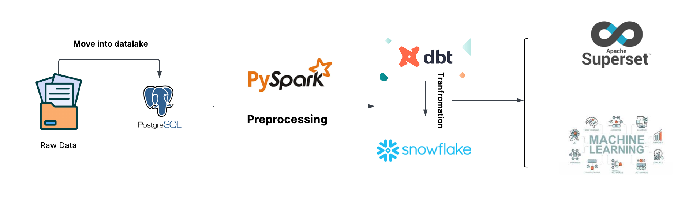
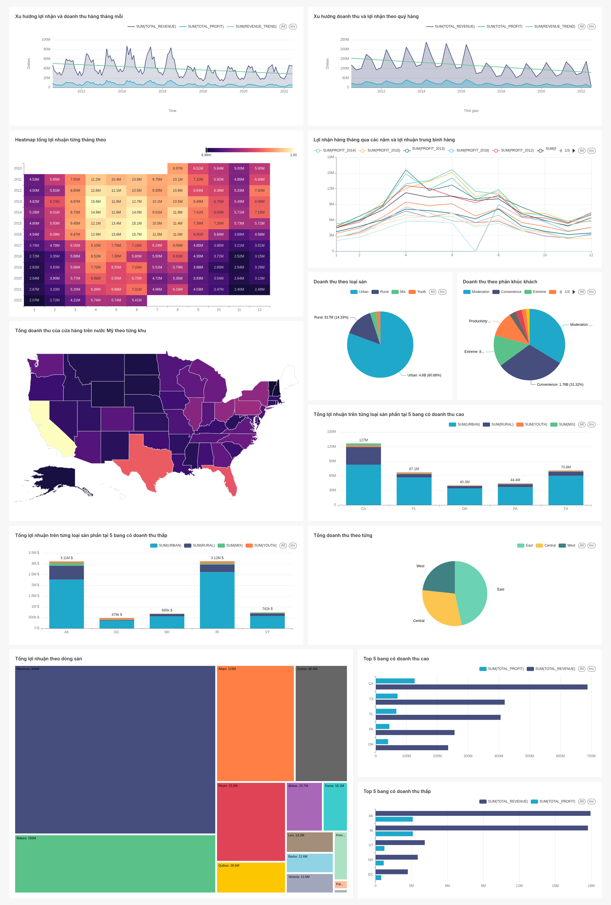

# FORECASTING BUSINESS PERFORMANCE

## 📝 Tổng quan

Dự án này xây dựng một pipeline để xử lý, phân tích và dự đoán tình hình kinh doanh của dữ liệu Sales được cung cấp bởi cuội thi DataFlow. Dữ liệu được xử lý thông qua pipeline **ELT** nhằm cung cấp những phân tích chuyên sâu về xu hướng và những yếu tố ảnh hưởng đến tình hình kinh doanh và sau đó dự đoán doanh thu và đưa ra kết luận.

---

## 📦 Dataset

Bộ dữ liệu được ban tổ chức cung cấp bao gồm 3 file .xlsx mô tả thông tin về chuỗi cửa hàng thời trang tại Mỹ. Tất cả các file  được lưu dưới dạng **Excel  thô** nên cần nhiều bước xử lý trước khi có thể sử dụng.

---

## 🧰 Công cụ & Công nghệ

* **Đóng gói**: [Docker](https://www.docker.com/), [Docker Compose](https://docs.docker.com/compose/)
* **Chuyển đổi dữ liệu**: [Apache Spark](https://spark.apache.org/), [dbt](https://www.getdbt.com/)
* **Data Lake**: [Postgreslq](https://www.postgresql.org/)
* **Data Warehouse**: [Snowflake](https://www.snowflake.com/en/)
* **Trực quan hóa**: [Apache Superset](https://superset.apache.org/)
* **Ngôn ngữ sử dụng**: Python, SQL

---

## 🏗️ Kiến trúc hệ thống

---

## 🔄 Chuyển đổi dữ liệu

Ban đầu dữ liệu là các file excel thô vì vậy trước khi đưa vào data warehouse cần được làm sạch bằng pyspark, sau đó sử dụng dbt để chuẩn hóa và chia các marts trong data ware house phù hợp với mục đích phân tích và dự đoán riêng.

### Spark

Spark được dùng để xử lý toàn bộ dữ liệu như xử lý gía trị thiếu, sai định dạng, ...  Sau đó ghi kết quả vào bảng trong Snowflake.

### dbt

Tất cả các bước chuẩn hóa dữ liệu từ data warehouse và chuẩn bị dữ liệu thành các marts sẽ sử dụng dbt.

---

## 📊 Dashboard

Dashboard được tạo bằng apache Superset nhằm minh họa xu hướng doanh thu, lợi nhuận và phân tích kĩ các yếu tố ảnh hưởng đến tình hình kinh doanh của chuỗi cửa hàng.

---

## Dự đoán
Sử dụng các model time series như arima và Xgboot để dự doán doanh thu và lợi nhuận. Để xem chi tiết kết quả hãy xem trong slide dưới đây.
[Slide](https://drive.google.com/file/d/13_bjXA_vS3H8W8r3q9eSS_ehv5DClfUr/view?usp=drive_link)

## 🔧 Hướng cải tiến

* ✅ Phân vùng bảng lõi để tăng hiệu suất
* 🧠 Khai thác giá trị từ dữ liệu đánh giá – tạo dashboard mới?
* 🧪 Viết thêm test cho pipeline
* 🎯 Chuẩn hóa lại dữ liệu để luyện tập thiết kế hệ thống

---

## Một số vấn đề đã gặp phải khi thực hiện dự án:

Kết nối pyspark để đẩy dữ liệu vào snowflake: gặp lỗi JDBC driver encountered communication error. Message: Exception encountered for HTTP request: sun.security.validator.ValidatorException: No trusted certificate found.

Cách khắc phục: thêm tham số "insecureMode": "true" vào sfOptions, nhưng cách này không thực sự tốt nếu triển khai ở môi trường productive.